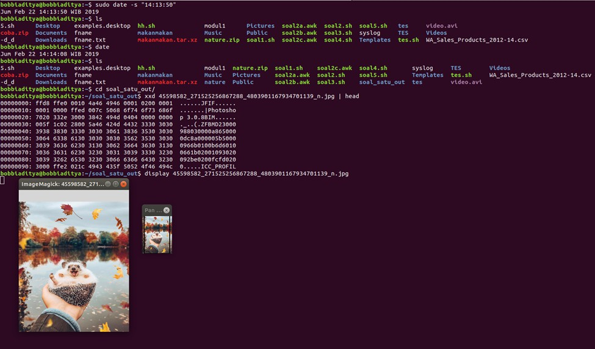
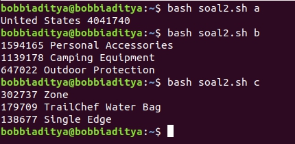
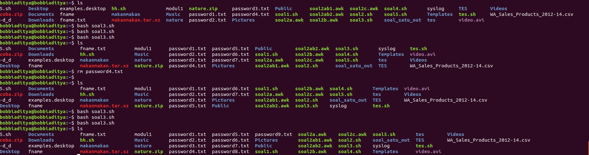
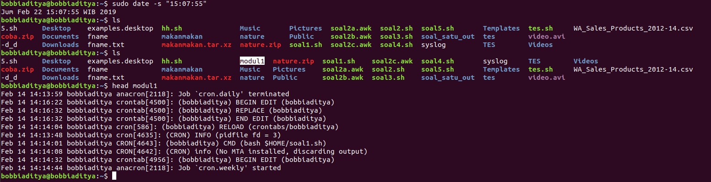

# SoalShift_modul1_E05
Soal Shift Modul 1 Sistem Operasi - Kelompok E05

```
05111740000052 Anggar Wahyu Wibowo 
05111740000099 Bobbi Aditya
```


## Soal 1

### Extracting Files

Pada soal ini, pertama kita harus mengekstrak filenya terlebih dahulu. Kita dapat melakukannya dengan ...

```bash
extracted=`ls -l | grep "^dr.*nature$"`

if [ ${#extracted} == 0 ]
then
    unzip nature.zip
fi
```

Variabel `extracted` akan mengecek apakah sudah ada folder nature atau belum, jika belum, maka berkas `nature.zip` akan kita ekstrak.

Lalu kita harus membuat folder tujuan untuk menyimpan file hasil ekstraksi tersebut. Hal tersebut dapat dilakukan dengan ...

```bash
folder_in=`pwd`"/nature"
folder_out=`pwd`"/soal_satu_out"

folder_out_exist=`ls -l | grep "^dr.*soal_satu_out$"`

if [ ${#folder_out_exist} == 0 ]
then
    mkdir `pwd`"/soal_satu_out"
fi
```

### Decoding Files

Langkah selanjutnya adalah decoding berkas-berkas yang telah kita ekstrak tersebut. Kita daoat melakukannya dengan ...

```bash
decode_img() {
    cat $2"/"$1 | base64 -d | xxd -r > $3"/"$1
}

file_list=`ls $folder_in`

for file in $file_list
do
    decode_img $file $folder_in $folder_out
    ... # command untuk subbab bawah
done
```

### Displaying Images

Kemudian kita harus menampilkan gambar tersebut. Hal ini dapat dilakukan dengan menggunakan utilitas `display` yang merupakan bawaan dari utilitas **ImageMagick**.

```bash
# Kita harus melakukan export display port 
# terlebih dahulu, agar berkas dapat dibuka
# di program GUI
export DISPLAY=:0

# Iterasi ini sama dengan iterasi di Decoding Files
for file in $file_list
do
   ... # command subbab atas
   display $folder_out/$file 
done
```

### Scheduling Job

Selanjutnya kita harus melakukan otomasi agar pada waktu yang sudah ditentukan, skrip akan jalan secara otomatis. Kita dapat melakukan penjadwalan dengan perintah `crontab -e`
dengan isi konfigurasi sebagai berikut

```c
14 14 14 2 5 bash $HOME/soal1.sh
```

### Hasil



## Soal 2

### Entry Point

Kali ini kita harus membuat *entry point* untuk subsoal a, b dan c.

```bash
case "$1" in
    "a") awk -F ',' -f soal2a.awk WA_Sales_Products_2012-14.csv;;
    "b") awk -F ',' -f soal2b.awk WA_Sales_Products_2012-14.csv | sort -nr | head -3;;
    "c") awk -F ',' -f soal2c.awk WA_Sales_Products_2012-14.csv | sort -nr | head -3;;
    "ab") awk -F ',' -f soal2a.awk WA_Sales_Products_2012-14.csv | 
    *) echo "Tidak ada subsoal selain a, b, dan c.";;
esac
```
### General Assumptions

Kita tahu bahwasanya berkas csv nilai antar *field*-nya dipisahkan oleh tanda koma (`,`). Oleh karenanya, kita dapat mengatur opsi di `awk` dengan opsi `-F ','`. Selain itu, untuk memudahkan keterbacaan, kami memisahkan kode `awk` dengan skrip `bash`. Lalu, kode tersebut dapat diakses dengan opsi `-f kode.awk`.

### Country with Highest Quantity Sales in 2012

Secara keseluruhan commandnya sendiri adalah:

```bash
awk -F ',' -f soal2a.awk WA_Sales_Products_2012-14.csv
```
#### soal2a.awk

Pertama, kita cari record yang nilai *field* `Year` (*field* ke-7) merupakan tahun 2012. Setelah itu, kita gunakan array `countryQuantity` untuk menyimpan agregat penjumlahan dari masing-masing negara.

```awk
{
    if($7 == "2012"){
        countryQuantity[$1] += $10;
    }
}
```
Setelah itu kita dapat mencetak negara dengan nilai kuantitas terbanyak. Untuk mencarinya, dapat menggunakan variabel bantuan `maxQuantity` dan `maxCountry`.

```awk
END {
    maxQuantity=0;
    maxCountry=""
    
    for(key in countryQuantity){
        if(maxQuantity < countryQuantity[key]){
            maxQuantity = countryQuantity[key];
            maxCountry = key;
        }
    }

    print maxCountry " " maxQuantity;
}
```

### Top Three Product Lines from United States in Year 2012

Secara keseluruhan commandnya sendiri adalah:

```bash
awk -F ',' -f soal2b.awk WA_Sales_Products_2012-14.csv
    | sort -nr
    | head -3
```

Berbeda dari subsoal a, command `awk` digunakan untuk mencari keseluruhan nilai agregat dari nilai `Quantity` dikelompokan berdasarkan field `ProductLine`.

#### soal2b.awk

Pertama, kita cari record yang nilai *field* `Year` (*field* ke-7) merupakan tahun 2012 dan field `Retailer country` adalah `United States`. Setelah itu, kita gunakan array `productLineQuantity` untuk menyimpan agregat penjumlahan dari masing-masing lini produk.

```awk
{
    if($1 == "United States" && $7 == "2012"){
        productLineQuantity[$4] += $10;
    }
}
```
Lalu kita akan mencetak keseluruhan nilai dari array `productLineQuantity` untuk selanjutnya dapat disaring kembali menggunakan utilitas `sort` dan `head`.

```awk
END {
    for(key in productLineQuantity){
        print productLineQuantity[key] " " key;
    }
}
```

### Top Three Products with Most Sales from Top Three Product Lines from United States in Year 2012 

Berbeda dari subsoal a, command `awk` digunakan untuk mencari keseluruhan nilai agregat dari nilai `Quantity` dikelompokan berdasarkan field `ProductLine`.

#### soal2c.awk

Pertama, kita cari record yang nilai *field* `Year` (*field* ke-7) merupakan tahun 2012, field `Retailer country` adalah `United States`, dan field `Product line` salah satu dari tiga product line yang telah kita peroleh sebelumnya. Setelah itu, kita gunakan array `productQuantity` untuk menyimpan agregat penjumlahan dari masing-masing produk.

```awk
{
    if($1 == "United States" && $7 == "2012"){
        if($4 == "Personal Accessories" ||
            $4 == "Camping Equipment"   ||
             $4 == "Outdoor Protection") {
                productQuantity[$6] += $10;
             }
    }
}
```
Lalu kita akan mencetak keseluruhan nilai dari array `productQuantity` untuk selanjutnya dapat disaring kembali menggunakan utilitas `sort` dan `head`, sehingga diperoleh hasil yang diinginkan.

```awk
END {
    for(key in productLineQuantity){
        print productLineQuantity[key] " " key;
    }
}
```

### Hasil



## Soal 3

### Creating Variables

Pertama kali, kita harus membuat variabel yang akan kita gunakan nantinya.

```bash
# variabel i digunakan untuk iterasi pada pengecekan file nantinya
# check_diff sebagai placeholder untuk mengetahui apakah
# ... password yang dihasilkan sudah sesuai dengan kriteria
# candf merupakan password kandidat yang akan digunakan

i=1
check_diff="ada" 
candf=""
```

### Password Candidate Generation

Langkah selanjutnya adalah melakukan pembuatan password secara acak.

```bash
until [ ${#check_diff} == 0 ]
do
    candf=`head /dev/urandom | tr -dc a-zA-Z0-9 | head -c 12 | 
            awk '$0 ~ /[a-z]/ && $0 ~ /[0-9]/ && $0 ~ /[A-Z]/ {print $0;}'`
    check_diff=`cat password*txt 2> /dev/null | grep ^"$candf"$`

    if [ ${#candf} == 0 ]
    then
        check_diff="ada"
    fi
done
```

Kita melakukan `until` loop sampai password memenuhi persyaratan. Loop yang kita lakukan adalah kita membuat kandidat password random yang memenuhi syarat. Syaratnya adalah harus ada huruf kecil, huruf kapital, dan angka didalamnya. Jika password random yang telah dibuat tidak memenuhi syarat, program akan mengenerate kandidat password yang baru, hingga memenuhi syarat dan tidak ada yang sama dibandingkan password-password sebelumnya.

`head /dev/urandom` >> mengambil head dari berkas random yang otomatis digenerate oleh kernel

`tr -dc a-zA-Z0-9` >> megubah karakter tersebut menjadi karakter huruf dan angka

`head -c 12` >> mengambil 12 karakter dari head

`awk '$0 ~ /[a-z]/ && $0 ~ /[0-9]/ && $0 ~ /[A-Z]/ {print $0;}'` >> mengecek apakah password yang digenerate memenuhi syarat

check_diff=`cat password*txt 2> /dev/null | grep ^"$candf"$` >> mencocokkan dengan password-password sebelumnya sudah apakah ada password yang sama atau tidak

```bash
   if [ ${#candf} == 0 ]
    then
        check_diff="ada"
    fi
```

Proses diatas adalah sebagai penanda apakah ada password yang sama dengan yang sebelumnya atau password yang digenerate tidak memenuhi syarat, maka akan dibuat kandidat password yang baru.

### Cek ketersediaan password

```bash
while [ 1 ]
do
    ls_out=`ls "password"$i".txt" 2> /dev/null`
    if [ ${#ls_out} == 0 ]
    then
        echo "$candf" > "password"$i".txt"
        break
    fi

    i=`expr $i + 1`
done
```

Proses diatas adalah untuk mengecek apakah password-password yang telah digenerate ada yang hilang atau dihapus. Apabila ada password yang hilang (contoh password yang ada password{1,2,4}), maka password yang hilang ini akan digenerate(password3). Apabila semua password masih ada, maka akan mengenerate password selanjutna.

### Hasil
   

## Soal 4

Pada soal nomor 4, kita diminta untuk melakukan backup syslog setiap jam dengan kriteria:

a. Nama file "jam:menit tanggal-bulan-tahun".

b. Isi dari file di enkrip menggunakan konversi huruf berdasarkan jam pada saat backup dilakukan

c. Selain script enkripsi, buat juga script untuk melakukan dekripsi.


Untuk kodingan script bisa diliat di [sini](https://github.com/anggar/SoalShift_modul1_E05/blob/master/soal4.sh)


Penjelasan dari script yang kami gunakan:

### Konversi huruf dan baca file

- `chr(){
 printf \\$(printf '%03o' $1)
}`>> Fungsi di atas berguna untuk merubah angka menjadi huruf

- `awal= cat /var/log/syslog` >> Berguna untuk menyimpan hasil pembacaan syslog ke dalam variabel syslog

- ```bash
  ordajam=`expr $jam + 65`
  ordzjam=`expr $jam + 65 - 1`
  chrajam=`chr $ordajam`
  chrzjam=`chr $ordzjam`
  ```
  Berguna untuk merubah jam, menjadi huruf yang nantinya digunakan dalam konversi, *chrajam* adalah perubahan dari huruf a sedangkan *chrzjam* adalah perubahan dari huruf z

### Nama file output

```bash
jam=`date +%H`
menit=`date +%M`
tanggal=`date +%d`
bulan=`date +%m`
tahun=`date +%Y`
```

  Berguna untuk menyimpan waktu, yang nantinya akan digunakan didalam nama file dan dasar melakukan enkripsi

```bash
fname="$jam:$menit $tanggal-$bulan-$tahun"
```
Berguna untuk memberi nama file output sesuai ketentuan

### Enkripsi

```bash
enkrip(){
  ordajam=`expr $jam + 65`
  ordzjam=`expr $jam + 65 - 1`
  chrajam=`chr $ordajam`
  chrzjam=`chr $ordzjam`
  if [ $jam -eq 0 ]
  then
    printf '%s' "$awal" >"$fname"
  elif [ $jam -eq 1 ]
  then
    printf '%s' "$awal" | tr A-Za-z B-ZAb-za >"$fname"
  else
    rule="$chrajam-ZA-$chrzjam"
    printf '%s' "$awal" | tr A-Za-z $rule${rule,,} > "$fname"
  fi
}
```
  Kodingan di atas adalah algoritma dalam proses perubahan karakter dari isi file syslog(enkripsi).

  Jika jam perubahan = 0, maka file syslog tidak akan melakukan enkripsi apapun

  Jika jam perubahan = 1, maka file syslog akan melakukann enkripsi dengan patokan, **a akan menjadi huruf b** dan **z akan mejadi huruf a**

  Jika jam perubahan bukan 0 atau 1m maka file syslof akan melakukan enkripsi sesuai rule yang ada menyesuaikan jam backup dilakukan.

  Di dalam algoritma ini, kami menggunakan fungsi tr. Fungsi tr sendiri berguna untuk merubah karakter-karakter dengan syarat yang ditentukan menjadi karakter-karater dengan syarat yang kita tentukan juga. Simpelnya, kita bisa mengubah semua huruf **a** menjadi huruf **b** dalam sebuah file dengan menggunakan `tr a b`.

  Karena dalam soal ini meminta melakukan enkripsi semua huruf, maka kita harus mengatur syarat yang bisa dipenuhi oleh semua huruf, baik huruf kecil maupun huruf besar. Maka dari itu kami menggunakan `tr A-Za-z $rule${rule,,}` agar semua huruf kecil maupun besar akan diubah hurufnya sesuai aturan enkripsi. `{rule,,}` berarti mengubah huruf besar menjadi huruf kecil

  Yang terakhir ` > "$fname" ` digunakan untuk menyimpan hasil enkripsi itu kedalam file yang tadi sudah kita beri nama sesuai dengan waktu dijalankannya script backup ini

### Dekripsi

```bash
dekrip(){
  jam=${1:0:2}
  awal=`cat "$1 $2"`
  fname="$1 $2_d"
  ordajam=`expr $jam + 65`
  ordzjam=`expr $jam + 65 - 1`
  chrajam=`chr $ordajam`
  chrzjam=`chr $ordzjam`
  if [ $jam -eq 0 ]
  then
    printf '%s' "$awal" >"$fname"
    #echo $awal > "$fname"
  elif [ $jam -eq 1 ]
  then
    printf '%s' "$awal" | tr B-ZAb-za A-Za-z >"$fname"
    #printf '%s' "$awal" | tr A-Za-z B-ZAb-za >"$fname"
    #echo $awal | tr A-Za-z B-ZAb-za > "$fname"
  else
    rule="$chrajam-ZA-$chrzjam"
    printf '%s' "$awal" | tr $rule${rule,,} A-Za-z > "$fname"  
    #printf '%s' "$awal" | tr A-Za-z $rule${rule,,} > "$fname"
    #echo $awal | tr A-Za-z $rule${rule,,} > "$fname"
  fi
}
  ```
  Kodingan di atas berguna untuk melakukan dekripsi. Konsep yang digunakan sama dengan enkripsi. Perbedaannya hanya berada pada kondisi **tr**. Jika pada enkripsi kita menggunakan ``A-Za-z B-ZAb-za``, pada dekrip kondisi tersebut dibalik menjadi ``B-ZAb-za``

### Argumen

```bash
case $1 in
  "-e") enkrip;;
  "-d") dekrip $2 $3;;
esac
```

Kodingan di atas berguna untuk menyediakan option dalam menjalankan script. Jika kita ingin menjalankan enkrip, maka kita perlu mengetikkan bashh soal4.sh -e. Jika kita ingin menjalankan dekripsi, kita perlu mengetikkan soal4.sh -d "namafile"

### Cron

Untuk mengatur agar script ini dijalankan sesuai waktu yang ditentukan, cron yang kami gunakan adalah

```c
0 * * * * bash $HOME/soal4.sh
```

Arti dari cron tersebut adalah **setiap 1 jam sekali** soal4.sh akan dijalankan


### Hasil
   


## Soal 5

Pada soal nomor 5, kita diminta untuk menampilkan syslog dengan syarat:

a.	Tidak mengandung string "sudo", tetapi mengandung string "cron". (case insensitive)

b.	Jumlah field (number of field) pada baris tersebut berjumlah kurang dari 13.
Kemudian menyimpan syslog tersebut didalam file bernama "modul1" dan script ini harus dijalankan setiap 6 menit dari menit ke 2 sampai menit ke 30.


script yang kami gunakan adalah:

```bash
cat /var/log/syslog | awk 'tolower($0) ~ /cron/ &&  tolower($0) ~ !/sudo/ {print $0;}' | awk 'NF<13' >> $HOME/modul1
```

### Pembacaan file

- `cat /var/log/syslog` >> berguna untuk menampilkan semua isi dari syslog

- `pipe(|)` >> berguna untuk menambahkan syarat-syarat tertentu yang harus di jalankan bersamaan dengan proses cat

### Case Insensitive

- `awk 'tolower($0) ~ /cron/ &&  tolower($0) ~ !/sudo/ {print $0;}'` >> berguna untuk melakukan pengecekan apakah ada kata 'cron' dan tidak ada kata 'sudo' di dalam setiap baris syslog. Sebelum melakukan pengecekan kata tersebut, setiap kata akan dilakukan proses tolower terlebih dahulu.

### Jumlah Kolom

- `awk 'NF<13'` >> berguna untuk memberi syarat bahwa baris yang di tampilkan harus memiliki < 13 field(kolom)

### Penamaan file output

- `>> $HOME/modul1` menyimpan hasil proses kedalam file 


### Cron

Untuk mengatur agar script ini dijalankan sesuai waktu yang ditentukan, cron yang kami gunakan adalah

```c
2-30/6 * * * * bash $HOME/soal5.sh
```

Arti dari cron tersebut adalah dari menit 2-30 **setiap 6 menit sekali** soal.5sh akan dijalankan

### Hasil

