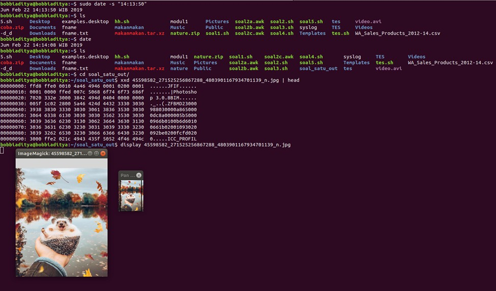

## Soal 1

### Extracting Files

Pada soal ini, pertama kita harus mengekstrak filenya terlebih dahulu. Kita dapat melakukannya dengan ...

```bash
extracted=`ls -l | grep "^dr.*nature$"`

if [ ${#extracted} == 0 ]
then
    unzip nature.zip
fi
```

Variabel `extracted` akan mengecek apakah sudah ada folder nature atau belum, jika belum, maka berkas `nature.zip` akan kita ekstrak.

Lalu kita harus membuat folder tujuan untuk menyimpan file hasil ekstraksi tersebut. Hal tersebut dapat dilakukan dengan ...

```bash
folder_in=`pwd`"/nature"
folder_out=`pwd`"/soal_satu_out"

folder_out_exist=`ls -l | grep "^dr.*soal_satu_out$"`

if [ ${#folder_out_exist} == 0 ]
then
    mkdir `pwd`"/soal_satu_out"
fi
```

### Decoding Files

Langkah selanjutnya adalah decoding berkas-berkas yang telah kita ekstrak tersebut. Kita daoat melakukannya dengan ...

```bash
decode_img() {
    cat $2"/"$1 | base64 -d | xxd -r > $3"/"$1
}

file_list=`ls $folder_in`

for file in $file_list
do
    decode_img $file $folder_in $folder_out
    ... # command untuk subbab bawah
done
```

### Displaying Images

Kemudian kita harus menampilkan gambar tersebut. Hal ini dapat dilakukan dengan menggunakan utilitas `display` yang merupakan bawaan dari utilitas **ImageMagick**.

```bash
# Kita harus melakukan export display port 
# terlebih dahulu, agar berkas dapat dibuka
# di program GUI
export DISPLAY=:0

# Iterasi ini sama dengan iterasi di Decoding Files
for file in $file_list
do
   ... # command subbab atas
   display $folder_out/$file 
done
```

### Scheduling Job

Selanjutnya kita harus melakukan otomasi agar pada waktu yang sudah ditentukan, skrip akan jalan secara otomatis. Kita dapat melakukan penjadwalan dengan perintah `crontab -e`
dengan isi konfigurasi sebagai berikut

```c
14 14 14 2 5 bash $HOME/soal1.sh
```

### Tangkapan Layar

