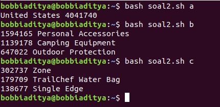

## Soal 2

### Entry Point

Kali ini kita harus membuat *entry point* untuk subsoal a, b dan c.

```bash
case "$1" in
    "a") awk -F ',' -f soal2a.awk WA_Sales_Products_2012-14.csv;;
    "b") awk -F ',' -f soal2b.awk WA_Sales_Products_2012-14.csv | sort -nr | head -3;;
    "c") awk -F ',' -f soal2c.awk WA_Sales_Products_2012-14.csv | sort -nr | head -3;;
    "ab") awk -F ',' -f soal2a.awk WA_Sales_Products_2012-14.csv | 
    *) echo "Tidak ada subsoal selain a, b, dan c.";;
esac
```
### General Assumptions

Kita tahu bahwasanya berkas csv nilai antar *field*-nya dipisahkan oleh tanda koma (`,`). Oleh karenanya, kita dapat mengatur opsi di `awk` dengan opsi `-F ','`. Selain itu, untuk memudahkan keterbacaan, kami memisahkan kode `awk` dengan skrip `bash`. Lalu, kode tersebut dapat diakses dengan opsi `-f kode.awk`.

### Country with Highest Quantity Sales in 2012

Secara keseluruhan commandnya sendiri adalah:

```bash
awk -F ',' -f soal2a.awk WA_Sales_Products_2012-14.csv
```
#### soal2a.awk

Pertama, kita cari record yang nilai *field* `Year` (*field* ke-7) merupakan tahun 2012. Setelah itu, kita gunakan array `countryQuantity` untuk menyimpan agregat penjumlahan dari masing-masing negara.

```awk
{
    if($7 == "2012"){
        countryQuantity[$1] += $10;
    }
}
```
Setelah itu kita dapat mencetak negara dengan nilai kuantitas terbanyak. Untuk mencarinya, dapat menggunakan variabel bantuan `maxQuantity` dan `maxCountry`.

```awk
END {
    maxQuantity=0;
    maxCountry=""
    
    for(key in countryQuantity){
        if(maxQuantity < countryQuantity[key]){
            maxQuantity = countryQuantity[key];
            maxCountry = key;
        }
    }

    print maxCountry " " maxQuantity;
}
```

### Top Three Product Lines from United States in Year 2012

Secara keseluruhan commandnya sendiri adalah:

```bash
awk -F ',' -f soal2b.awk WA_Sales_Products_2012-14.csv
    | sort -nr
    | head -3
```

Berbeda dari subsoal a, command `awk` digunakan untuk mencari keseluruhan nilai agregat dari nilai `Quantity` dikelompokan berdasarkan field `ProductLine`.

#### soal2b.awk

Pertama, kita cari record yang nilai *field* `Year` (*field* ke-7) merupakan tahun 2012 dan field `Retailer country` adalah `United States`. Setelah itu, kita gunakan array `productLineQuantity` untuk menyimpan agregat penjumlahan dari masing-masing lini produk.

```awk
{
    if($1 == "United States" && $7 == "2012"){
        productLineQuantity[$4] += $10;
    }
}
```
Lalu kita akan mencetak keseluruhan nilai dari array `productLineQuantity` untuk selanjutnya dapat disaring kembali menggunakan utilitas `sort` dan `head`.

```awk
END {
    for(key in productLineQuantity){
        print productLineQuantity[key] " " key;
    }
}
```

### Top Three Products with Most Sales from Top Three Product Lines from United States in Year 2012 

Berbeda dari subsoal a, command `awk` digunakan untuk mencari keseluruhan nilai agregat dari nilai `Quantity` dikelompokan berdasarkan field `ProductLine`.

#### soal2c.awk

Pertama, kita cari record yang nilai *field* `Year` (*field* ke-7) merupakan tahun 2012, field `Retailer country` adalah `United States`, dan field `Product line` salah satu dari tiga product line yang telah kita peroleh sebelumnya. Setelah itu, kita gunakan array `productQuantity` untuk menyimpan agregat penjumlahan dari masing-masing produk.

```awk
{
    if($1 == "United States" && $7 == "2012"){
        if($4 == "Personal Accessories" ||
            $4 == "Camping Equipment"   ||
             $4 == "Outdoor Protection") {
                productQuantity[$6] += $10;
             }
    }
}
```
Lalu kita akan mencetak keseluruhan nilai dari array `productQuantity` untuk selanjutnya dapat disaring kembali menggunakan utilitas `sort` dan `head`, sehingga diperoleh hasil yang diinginkan.

```awk
END {
    for(key in productLineQuantity){
        print productLineQuantity[key] " " key;
    }
}
```

### Hasil

