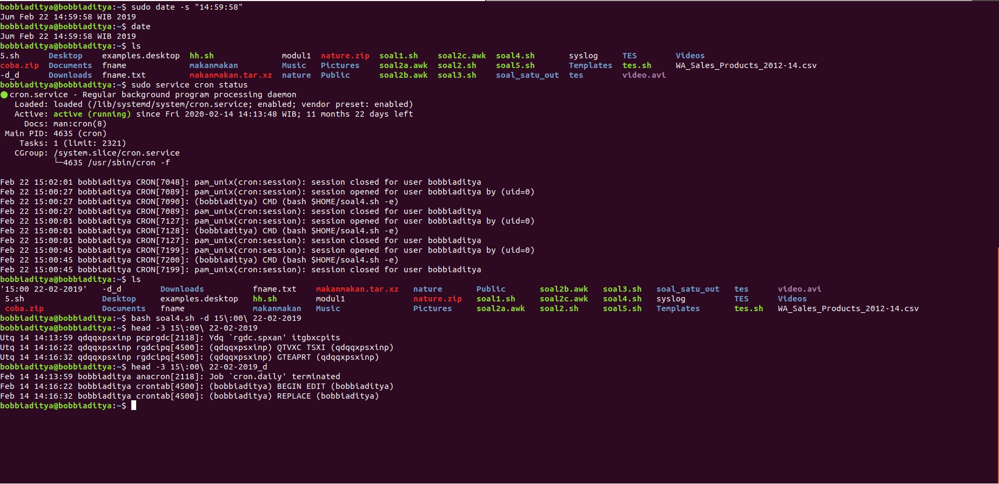

## Soal 4

Pada soal nomor 4, kita diminta untuk melakukan backup syslog setiap jam dengan kriteria:

a. Nama file “jam:menit tanggal-bulan-tahun”.

b. Isi dari file di enkrip menggunakan konversi huruf berdasarkan jam pada saat backup dilakukan

c. Selain script enkripsi, buat juga script untuk melakukan dekripsi.


Untuk kodingan script bisa diliat di [sini](https://github.com/anggar/SoalShift_modul1_E05/blob/master/soal4.sh)


Penjelasan dari script yang kami gunakan:

### Konversi huruf dan baca file

- `chr(){
 printf \\$(printf '%03o' $1)
}`>> Fungsi di atas berguna untuk merubah angka menjadi huruf

- `awal= cat /var/log/syslog` >> Berguna untuk menyimpan hasil pembacaan syslog ke dalam variabel syslog

- ```
  ordajam=`expr $jam + 65`
  ordzjam=`expr $jam + 65 - 1`
  chrajam=`chr $ordajam`
  chrzjam=`chr $ordzjam`
  ```
  Berguna untuk merubah jam, menjadi huruf yang nantinya digunakan dalam konversi, *chrajam* adalah perubahan dari huruf a sedangkan *chrzjam* adalah perubahan dari huruf z

### Nama file output

- jam=`date +%H`
  menit=`date +%M`
  tanggal=`date +%d`
  bulan=`date +%m`
  tahun=`date +%Y`

  Berguna untuk menyimpan waktu, yang nantinya akan digunakan didalam nama file dan dasar melakukan enkripsi

- `fname="$jam:$menit $tanggal-$bulan-$tahun"` >> Berguna untuk memberi nama file output sesuai ketentuan

### Enkripsi

- ```
	enkrip(){
	ordajam=`expr $jam + 65`
	ordzjam=`expr $jam + 65 - 1`
	chrajam=`chr $ordajam`
	chrzjam=`chr $ordzjam`
	if [ $jam -eq 0 ]
	then
	  printf '%s' "$awal" >"$fname"
	  #echo $awal > "$fname"
	elif [ $jam -eq 1 ]
	then
	  printf '%s' "$awal" | tr A-Za-z B-ZAb-za >"$fname"
	  #echo $awal | tr A-Za-z B-ZAb-za > "$fname"
	else
	  rule="$chrajam-ZA-$chrzjam"
	  printf '%s' "$awal" | tr A-Za-z $rule${rule,,} > "$fname"
	  #echo $awal | tr A-Za-z $rule${rule,,} > "$fname"
	fi
}
  ```
  Kodingan di atas adalah algoritma dalam proses perubahan karakter dari isi file syslog(enkripsi).

  Jika jam perubahan = 0, maka file syslog tidak akan melakukan enkripsi apapun

  Jika jam perubahan = 1, maka file syslog akan melakukann enkripsi dengan patokan, **a akan menjadi huruf b** dan **z akan mejadi huruf a**

  Jika jam perubahan bukan 0 atau 1m maka file syslof akan melakukan enkripsi sesuai rule yang ada menyesuaikan jam backup dilakukan.

  Di dalam algoritma ini, kami menggunakan fungsi tr. Fungsi tr sendiri berguna untuk merubah karakter-karakter dengan syarat yang ditentukan menjadi karakter-karater dengan syarat yang kita tentukan juga. Simpelnya, kita bisa mengubah semua huruf **a** menjadi huruf **b** dalam sebuah file dengan menggunakan `tr a b`.

  Karena dalam soal ini meminta melakukan enkripsi semua huruf, maka kita harus mengatur syarat yang bisa dipenuhi oleh semua huruf, baik huruf kecil maupun huruf besar. Maka dari itu kami menggunakan `tr A-Za-z $rule${rule,,}` agar semua huruf kecil maupun besar akan diubah hurufnya sesuai aturan enkripsi. `{rule,,}` berarti mengubah huruf besar menjadi huruf kecil

  Yang terakhir ` > "$fname" ` digunakan untuk menyimpan hasil enkripsi itu kedalam file yang tadi sudah kita beri nama sesuai dengan waktu dijalankannya script backup ini

### Dekripsi

- ```
  dekrip(){
        jam=${1:0:2}
        awal=`cat "$1 $2"`
        fname="$1 $2_d"
        ordajam=`expr $jam + 65`
        ordzjam=`expr $jam + 65 - 1`
        chrajam=`chr $ordajam`
        chrzjam=`chr $ordzjam`
        if [ $jam -eq 0 ]
        then
          printf '%s' "$awal" >"$fname"
          #echo $awal > "$fname"
        elif [ $jam -eq 1 ]
        then
          printf '%s' "$awal" | tr B-ZAb-za A-Za-z >"$fname"
          #printf '%s' "$awal" | tr A-Za-z B-ZAb-za >"$fname"
          #echo $awal | tr A-Za-z B-ZAb-za > "$fname"
        else
          rule="$chrajam-ZA-$chrzjam"
          printf '%s' "$awal" | tr $rule${rule,,} A-Za-z > "$fname"  
          #printf '%s' "$awal" | tr A-Za-z $rule${rule,,} > "$fname"
          #echo $awal | tr A-Za-z $rule${rule,,} > "$fname"
        fi
   }
```
  Kodingan di atas berguna untuk melakukan dekripsi. Konsep yang digunakan sama dengan enkripsi. Perbedaannya hanya berada pada kondisi **tr**. Jika pada enkripsi kita menggunakan ``A-Za-z B-ZAb-za``, pada dekrip kondisi tersebut dibalik menjadi ``B-ZAb-za``

### Argumen
- ```
	case $1 in
        "-e") enkrip;;
        "-d") dekrip $2 $3;;
	esac
   ```
   Kodingan di atas berguna untuk menyediakan option dalam menjalankan script. Jika kita ingin menjalankan enkrip, maka kita perlu mengetikkan bashh soal4.sh -e. Jika kita ingin menjalankan dekripsi, kita perlu mengetikkan soal4.sh -d "namafile"

###Cron

Untuk mengatur agar script ini dijalankan sesuai waktu yang ditentukan, cron yang kami gunakan adalah

0 * * * * bash $HOME/soal4.sh

Arti dari cron tersebut adalah **setiap 1 jam sekali** soal.5sh akan dijalankan


###Hasil
   


